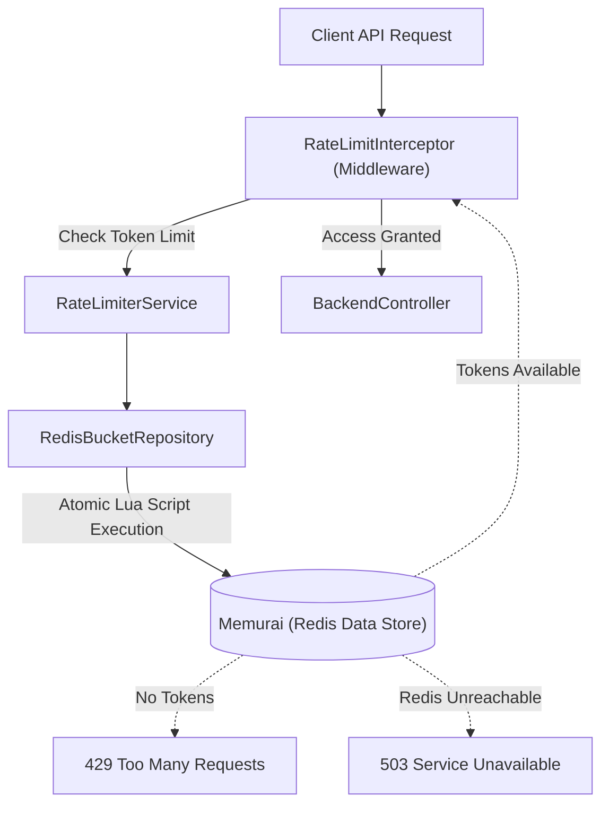

# 🛡️ API Rate Limiter Service (Distributed Architecture)

A production-ready, highly available API Rate Limiter implementation utilizing the **Token Bucket Algorithm**. This service is fully distributed, using **Redis (Memurai)** to guarantee atomicity and thread-safety across multiple application instances.

---

## ✨ System Capabilities

### 1. High-Performance Rate Limiting
- **Token Bucket Algorithm**: Standard algorithm for controlling traffic flow with high precision.
- **Distributed State**: Uses Redis (Memurai) as the centralized data store so rate limits apply globally, even if you run multiple instances of this Spring Boot service.
- **Atomic Lua Scripts**: Eliminates race conditions and the need for traditional database locks by using Redis Lua scripts (Read-Modify-Write pattern) to execute token math atomically.

### 2. Architecture & Middleware
- **Spring `HandlerInterceptor`**: Intercepts and enforces limits across all `/api/backend/**` endpoints BEFORE the request ever reaches the controller.
- **Dynamic Tiering**: Differentiates clients via the `X-User-Id` header, dynamically applying different capacities and refill rates based on the client.

### 3. Resilience & Graceful Degradation
- **Fail-Closed / Fail-Open Mechanics**: If the Redis server goes offline, the system is designed to fail gracefully.
- **Custom Lettuce Configuration**: Overrides the default 60-second command timeout with a strict 2-second timeout using a custom `LettuceConnectionFactory`. 
- **Instant 503 Responses**: If Redis crashes, the application does not hang. It instantly returns a `503 Service Unavailable` error, protecting the backend from cascading failures.

---

## 🏗️ Architecture Diagram



---

## 💻 Environment Setup

### Prerequisites
1. **Java 17+**
2. **Maven**
3. **Memurai** (Redis for Windows)
   - Download from [Memurai.com](https://www.memurai.com/).
   - Install and verify the service is running on default port `6379`.

### Starting the Application
Clone the repository and run the application via Maven:
```bash
./mvnw.cmd spring-boot:run
```

---

## 🧪 Testing Guide

### 1. Normal Rate Limiting Behavior (HTTP 429)
1. Open Postman or your terminal.
2. Send a `GET` request to `http://localhost:8080/api/backend/employees/1` with the header `X-user-id: Client-A`.
3. Check the response headers. You will see `X-RateLimit-Remaining` decrease with each request.
4. Send multiple requests rapidly.
5. Once the token bucket is exhausted, the API will reject the request with a **`429 Too Many Requests`** status and a `Retry-After` header.

### 2. Graceful Degradation Testing (HTTP 503)
This test validates the custom 2-second Lettuce command timeout.
1. Ensure the Spring Boot application is running normally.
2. Open a Command Prompt as Administrator and stop the Redis service:
   ```cmd
   net stop memurai
   ```
3. Immediately send a request to the API via Postman.
4. **Validation:** The request will *not* hang for 60 seconds. Within 2 seconds, the application will forcefully timeout the Redis connection attempt and return a **`503 Service Unavailable`** response.
5. Restart Memurai (`net start memurai`) to see the system instantly recover and resume normal operations.

---

## 📑 HTTP Header Reference

| Header | Type | Description |
| :--- | :--- | :--- |
| `X-User-Id` | **Request** | Identifies the client to determine their specific rate-limit tier. |
| `X-RateLimit-Capacity` | **Response** | The total maximum capacity of tokens for this user's bucket. |
| `X-RateLimit-Remaining` | **Response** | The number of tokens currently left for this user. |
| `X-RateLimit-Reset` | **Response** | Time in seconds until the bucket is completely refilled. |
| `Retry-After` | **Response** | (Present on 429 only). The time in seconds the client must wait before retrying. |

---
*Created by Vanshika - Distributed API Rate Limiter Service*
