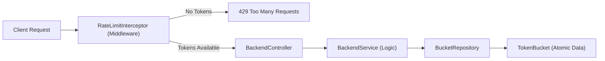

# 🛡️ API Rate Limiter Service (Spring Boot)

A production-ready, high-performance API Rate Limiter implementation using the **Token Bucket Algorithm** and Spring's **HandlerInterceptor** middleware.

---

##  Key Features

- **Token Bucket Algorithm**: Standard algorithm for controlling traffic flow with high precision.
- **Middleware Integration**: Enforces limits across all `/api/backend/**` endpoints BEFORE they reach the controller.
- **Thread-Safe Architecture**: Designed using `AtomicLong` and `synchronized` blocks to handle hundreds of concurrent requests without race conditions.
- **Dynamic Limit Configuration**: Different limits for Users (via `X-User-Id`), IP addresses, and generic API keys.
- **Production Error Handling**: Custom `RateLimitExceededException` (429), `InvalidKeyException` (400), and `ResourceNotFoundException` (404) with standardized JSON responses.
- **Actuator Integration**: Real-time health monitoring and performance metrics.

---

## 🏗️ System Architecture

The request processing flow ensures that the backend is never overloaded:



---

## 🛠️ API Endpoints

### 1. Protected Backend APIs (`/api/backend/**`)
*All these endpoints require a token from your bucket. If the limit is reached, they return HTTP 429.*

| Method | Endpoint | Description |
| :--- | :--- | :--- |
| `GET` | `/api/backend/data` | Fetches general dashboard data. |
| `GET` | `/api/backend/users/{id}` | Fetches user profile. (Try ID `0` for 404 test) |
| `POST` | `/api/backend/process` | Triggers background work with +50ms simulated latency. |

### 2. Rate Limiter Admin APIs (`/api/rate-limit/**`)
*Administrative endpoints for monitoring and testing the system.*

| Method | Endpoint | Description |
| :--- | :--- | :--- |
| `GET` | `/api/rate-limit/status/{key}` | Views current bucket state (doesn't consume tokens). |
| `POST` | `/api/rate-limit/reset/{key}` | Immediately resets a bucket to its max capacity. |
| `GET` | `/api/rate-limit/health` | Infrastructure health check. |

---

## 📑 Header Reference

| Header | Description |
| :--- | :--- |
| `X-User-Id` | (Request) Used to identify the client for rate-limiting. Fallback is the IP address. |
| `X-RateLimit-Remaining` | (Response) How many tokens are left for you in the current window. |
| `X-RateLimit-Capacity` | (Response) The maximum capacity of your specified bucket. |
| `X-RateLimit-Reset` | (Response) Seconds until the next token refill. |
| `Retry-After` | (Response - 429 Only) Standard HTTP header specifying wait time in seconds. |

---

## 💻 How to Run & Test

### 1. Run Application
```bash
./mvnw.cmd spring-boot:run
```

### 2. Run Tests
```bash
./mvnw.cmd test
```

### 3. Test with Postman
Import the `API-Rate-Limiter-Collection.json` file. Use the `base_url` variable.

### 4. Test with cURL (Parallel)
Run multiple requests in parallel to trigger a 429:
```bash
# Windows (PowerShell)
1..60 | ForEach-Object { curl.exe -s -I -H "X-user-id: Rohan" http://localhost:8080/api/backend/employees/3 | Select-String "HTTP/" }


FOR /L %i IN (1,1,60) DO curl -s -I -H "X-user-id: Rohan" http://localhost:8080/api/backend/employees/3

## 🧪 Demo Scenario

1.  **Step 1: Normal Access** — Send a request to `/api/data` with `X-User-Id: user-1`. Success! Note the `X-RateLimit-Remaining` header.
2.  **Step 2: Exhaustion** — Send 5 more requests quickly. The 6th request will return **HTTP 429** with a `Retry-After` reset timer.
3.  **Step 3: Refill** — Wait for the time indicated in `Retry-After`. Try again. Success!
4.  **Step 4: Admin Reset** — When blocked, send a `POST` to `/api/rate-limit/reset/user:user-1`. Try the backend again. Immediate success!

---
*Created by vanshika - API Rate Limiter Service Implementation*
