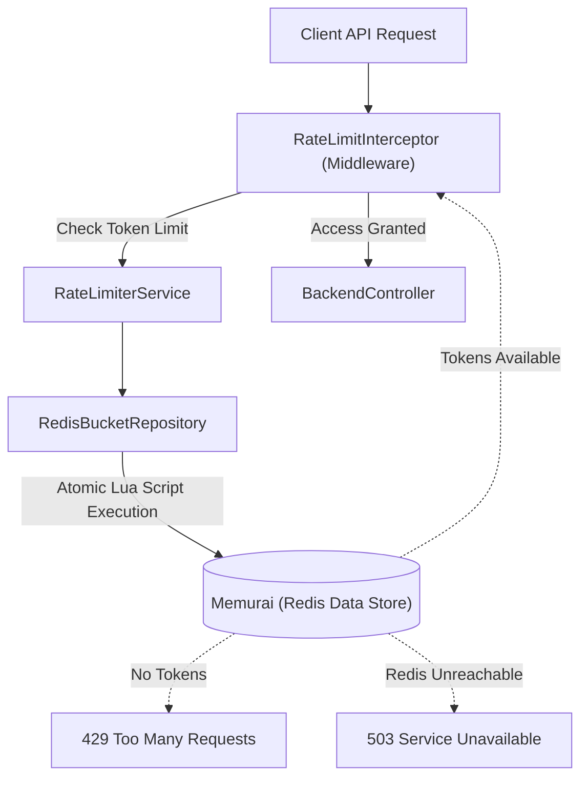

# 🛡️ API Rate Limiter Service (Distributed Architecture)

A production-ready, highly available API Rate Limiter implementation utilizing the **Token Bucket Algorithm**. This service is fully distributed, using **Redis (Memurai)** to guarantee atomicity and thread-safety across multiple application instances.

---

## 📖 What You Need to Know Before Reading the Code

If you are reviewing this repository for Phase 2, here are the core architectural decisions and concepts you should understand before diving into the source files:

### 1. Why Redis & Lua Scripts? (The Concurrency Solution)
In a distributed system, multiple requests for the same user can hit different servers at the exact same millisecond. If we read the token count, subtract one, and write it back using standard Java code, we risk a **race condition**. 
To solve this, we use a **Redis Lua Script** (`rate_limiter.lua`). Redis is single-threaded, meaning it executes Lua scripts atomically. The entire Read-Modify-Write operation happens in one uninterrupted step, guaranteeing 100% thread safety without using slow database locks.

### 2. The Middleware Approach (Interceptors)
Rate limiting shouldn't clutter business logic. We use a Spring **`HandlerInterceptor`** (`RateLimitInterceptor.java`). This acts as a shield—every request to `/api/backend/**` is intercepted and validated against Redis *before* it ever reaches the backend controller.

### 3. Graceful Degradation (The 503 Fix)
If the Redis server crashes, we do not want our Spring Boot application to hang while waiting for a response. We implemented a custom `LettuceConnectionFactory` (`RedisConfig.java`) that overrides the default 60-second connection timeout with a strict **2-second command timeout**. If Redis is unreachable, the system instantly fails safely, returning a `503 Service Unavailable` response to protect the backend.

### 4. Key Files to Review
To understand the core mechanics of Phase 2, review these files in order:
1. `src/main/resources/rate_limiter.lua` *(The atomic token math)*
2. `RedisBackedTokenBucket.java` *(Executes the Lua script)*
3. `RateLimitInterceptor.java` *(The middleware shield)*
4. `RedisConfig.java` *(The graceful degradation timeout fix)*

---

## 🏗️ Architecture Diagram



---

## 💻 Environment Setup & Commands

### Prerequisites
1. **Java 17+**
2. **Maven**
3. **Memurai** (Redis for Windows)
   - Download from [Memurai.com](https://www.memurai.com/).
   - Install and verify the service is running.

### 1. Start the Redis Server
Open an Administrator Command Prompt and ensure Memurai is running:
```cmd
net start memurai
```

### 2. Run the Application
Open your terminal in the project root and start Spring Boot:
```bash
./mvnw.cmd spring-boot:run
```

### 3. Run the Test Suite
```bash
./mvnw.cmd test
```

---

## 🧪 Testing Scenarios

### Scenario 1: Triggering the Rate Limit (HTTP 429)
1. Send a `GET` request to `http://localhost:8080/api/backend/employees/1` with the header `X-user-id: Client-A`.
2. Notice the `X-RateLimit-Remaining` header in the response.
3. Send multiple requests rapidly to exhaust the bucket.
4. The system will block further requests and return **`429 Too Many Requests`** along with a `Retry-After` header.

### Scenario 2: Testing Graceful Degradation (HTTP 503)
1. With the Spring Boot app running, stop the Redis server:
   ```cmd
   net stop memurai
   ```
   *(Alternatively, use `memurai-cli` and run the `SHUTDOWN` command).*
2. Immediately send an API request via Postman.
3. **Validation:** The request will not hang. Within 2 seconds, the application will timeout the connection attempt and return a **`503 Service Unavailable`** response.
4. Restart Memurai to see the system instantly recover.

---

## 📑 HTTP Header Reference

| Header | Type | Description |
| :--- | :--- | :--- |
| `X-User-Id` | **Request** | Identifies the client to determine their specific rate-limit tier. |
| `X-RateLimit-Capacity` | **Response** | The total maximum capacity of tokens for this user's bucket. |
| `X-RateLimit-Remaining` | **Response** | The number of tokens currently left for this user. |
| `X-RateLimit-Reset` | **Response** | Time in seconds until the bucket is completely refilled. |
| `Retry-After` | **Response** | (Present on 429 only). The time in seconds the client must wait before retrying. |

---
*Created by Vanshika - Distributed API Rate Limiter Service*
