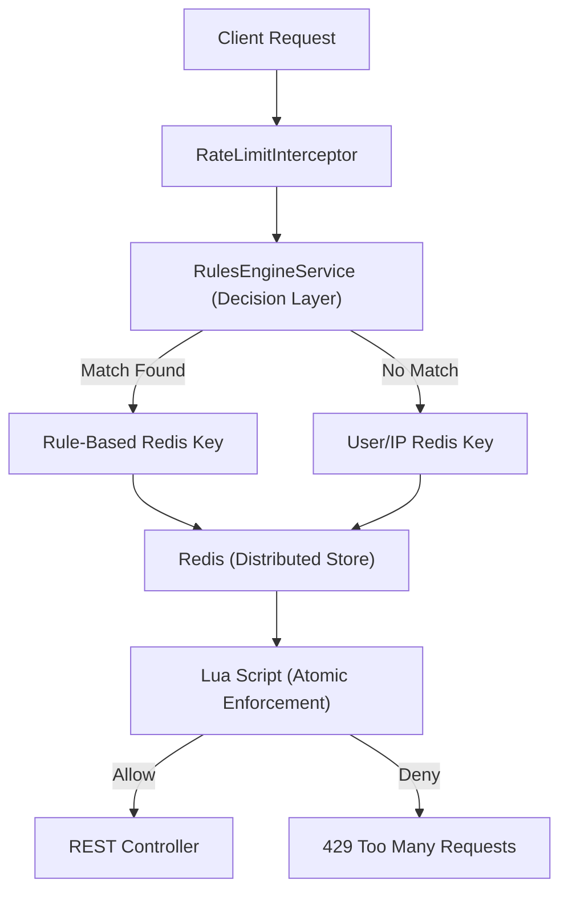

# 🛡️ API Rate Limiter Service (Distributed & Dynamic)

A production-grade, distributed API Rate Limiter implementation using **Spring Boot**, **Redis**, and the **Token Bucket Algorithm**. This service is designed for horizontal scalability and high-concurrency environments.

---

## 🚀 Phase 2 Features (Distributed & Dynamic)

On top of the core Phase 1 functionality, we have implemented:

-   **Distributed Rate Limiting (Redis + Lua)**: Uses Redis as a centralized state store. Concurrent requests across multiple application instances are handled atomically using **Lua Scripts** to eliminate race conditions.
-   **Advanced Rules Engine**: A dynamic decision layer that allows per-endpoint and time-based rate limits.
    -   **Path Matching**: Specific limits for paths like `/api/backend/employees/**`.
    -   **Rule Priority**: Sophisticated rules can override global defaults.
    -   **Time Windows**: "Peak Hour" rules (e.g. 09:00 - 17:00) vs "Off-Peak" rules.
-   **Fail-Open Resilience**: If Redis is unreachable, the system automatically "fails open" to ensure API availability.
-   **Concurrency Validation**: High-load integration tests proving 100% atomicity under parallel traffic.

---

## 🏗️ System Architecture

The transition from in-memory to distributed ensures consistent limits regardless of which server node handles the request:



---

## 🛠️ API Reference

### 1. Backend APIs (Protected)
| Method | Endpoint | Description |
| :--- | :--- | :--- |
| `GET` | `/api/backend/employees` | List employees (Subject to default or rule-based limits). |
| `POST` | `/api/backend/employees` | Create employee (Higher-priority strict rules often apply here). |

### 2. Rate Limiter Admin APIs (Observability)
| Method | Endpoint | Description |
| :--- | :--- | :--- |
| `GET` | `/api/rate-limit/status/{key}` | Inspect Redis state for a specific key. |
| `POST` | `/api/rate-limit/reset/{key}` | Atomically clear Redis counters for a user. |

### 3. Dynamic Rules API (Management)
| Method | Endpoint | Description |
| :--- | :--- | :--- |
| `GET` | `/api/rules` | List all active rate limit rules in priority order. |
| `POST` | `/api/rules` | Add a new rule (Path, Method, Capacity, Priority, Time). |

---

## 📑 Header Logic
-   `X-RateLimit-Remaining`: Tokens left in the current window.
-   `X-RateLimit-Capacity`: Max tokens for the matching rule/user.
-   `X-RateLimit-Reset`: Seconds until next refill.
-   `Retry-After`: (On 429) Wait time.

---

## 💻 How to Run

### Distributed Mode (Default)
Requires Redis running on `localhost:6379`.
```bash
./mvnw.cmd spring-boot:run
```

### Local/Offline Mode (In-Memory)
Disables Redis and uses `ConcurrentHashMap`.
```bash
./mvnw.cmd spring-boot:run -Dspring-boot.run.profiles=local
```

### Run Concurrency Validation
```bash
./mvnw.cmd test -Dtest=RateLimiterConcurrencyTest
```

---

## 🧪 Demo Scenario (For Panel Review)

1.  **Distributed Consistency**: Launch two instances of the app. Fire 3 requests to Instance A and 2 to Instance B. Note that Instance B's headers correctly show `Remaining: 0` because they share Redis.
2.  **Dynamic Rule**: Add a rule for `POST /api/backend/employees` with `capacity: 2`. Show that the 3rd POST is blocked while GET requests to the same path stay open.
3.  **Atomic Load**: Run the `RateLimiterConcurrencyTest` to demonstrate that 100 parallel threads never result in "stolen" tokens.

---
*Developed as part of the Internship Technical Assessment - Phase 2 Completion*
